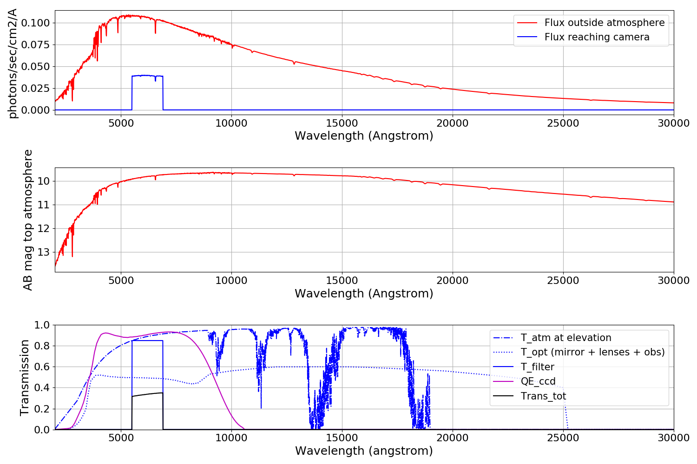

=====
Usage
=====

Examples
========

Illustrative example
--------------------

To use pyETC in a project:

.. code:: python

   >>> import os
   >>> from pyETC.pyETC import etc
    
   >>> # load ETC with a config file and the COLIBRI caracteristics
   >>> COLIBRI_ETC=etc(configFile=os.getenv('pyETC_DIR')+'/pyETC/configFiles/example.hjson',
            name_telescope='COLIBRI')
    
   >>> # Execute 
   >>> COLIBRI_ETC.sim()

It will display the following information in the terminal:

.. literalinclude:: ./files/results_summary_Ex_illus.txt

As well as a summary plot:

Compute the SNR for a given magnitude and exposure time
-------------------------------------------------------

We keep using COLIBRI telescope and let's say we want to compute the SNR reached for
a magnitude of 18 (AB) in a single exposure of 20s in the *i* band.

.. code:: python

   >>> COLIBRI_ETC.information['etc_type'] = 'snr'
   >>> COLIBRI_ETC.information['object_type'] = 'magnitude'
   >>> COLIBRI_ETC.information['object_magnitude'] = 18
   >>> COLIBRI_ETC.information['exptime'] = 20
   >>> COLIBRI_ETC.information['filter_band'] = 'i'
   >>> COLIBRI_ETC.sim()

It will also display information and plots but we do not show them here. 
If you just want the SNR, you can get it through:

.. code:: python

      >>> COLIBRI_ETC.information['SNR']
      49.92

Compute the limiting magnitude for a given SNR and exposure time
----------------------------------------------------------------

We keep using COLIBRI telescope and this time we want to compute the limiting magnitude in the J band for a SNR of 10 and a single exposure of 30s. We need to use the NIR channel, which is named CAGIRE in the hjson file.

.. code:: python

   >>> COLIBRI_ETC.information['etc_type'] = 'mag'
   >>> COLIBRI_ETC.information['SNR'] = 10
   >>> COLIBRI_ETC.information['exptime'] = 30
   >>> COLIBRI_ETC.information['channel'] = 'CAGIRE'
   >>> COLIBRI_ETC.information['filter_band'] = 'J'
   
   >>> COLIBRI_ETC.sim()

It will also display information and plots but we do not show them here. 
If you just want the magnitude, you can get it through:

.. code:: python

      >>> COLIBRI_ETC.information['mag']
      19.13

Add new Telescope
=================

The telescopes are stored in pyETC/telescope_database/ in a hjson format.   
This file contains all caracteristics of the telescope and its environment you do not need to modify for different observations. (Size of the mirrors, number ad type of lenses, mirrors..., sky background, atmosphere transmission, cameras caracteristics,...).

An example is seen below with the *default.hjson*. The hjson file is composed of 4 parts: the local conditions, main telescope characteristics, optical design and cameras characteristics.

Local conditions
----------------

This part contains information related to the observational site: sky brightness and atmosphere transmission. 
The sky brigthness is loaded from a file stored in *pyETC/local_conditions/sky_brightness/*, where the magnitude per arcsec^2 is given for different filter bands and at different moon age. A moon age of 0 and 14 correspond to a new moon and a full moon respectively. For instance the file corresponding to the sky brightness at the Observatorio Astronomico Nacional is:

.. literalinclude:: ./files/OAN.dat

The atmospheric transmission can be either loaded from a file or computed if extinction data are available. In the example below, it is loaded from the file OAN_atm_trans located in *pyETC/local_conditions/atmosphere/*.

Telescope
---------

Optical design
--------------

Cameras
-------

.. literalinclude:: ./files/default.hjson

